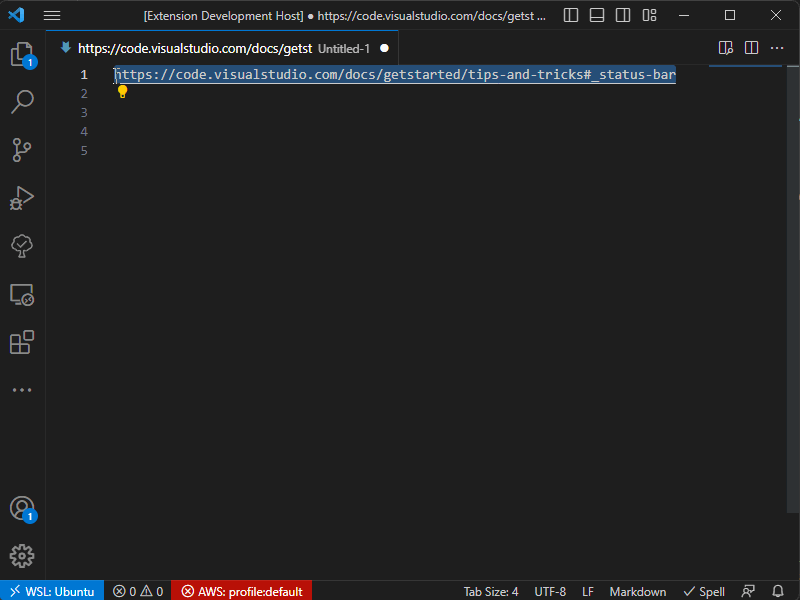

# URL Mangler

VS Code extension that formats highlighted URLs in the text editor.

## Features

**Recognises URLs for**:

* Confluence
* GitLab URLs
* Javadoc URLs (handling triggers when the url contains 'javadoc')
* JIRA
* SharePoint URLs
* And can be used on other sites. YMMV.

**Detection of**:

* URL fragments which link to a section within the page. The section title is extracted as part of the display name.

**Extracts display names to the following formats**:

|Format|Pattern|Comments|
|------|-------|--------|
|Display name only|``{display name}``|Extracts just the display name only without the URL|
|HTML href|``<a href="{display name}">{url}</a>``|Extracts as a HTML ``<a>`` anchor tag. Note this is plain text, not text/html. See [Known Issues](#known-issues) section below. |
|JIRA text syntax|``[{display name}\|{url}]``|Extracts to JIRA's text syntax|
|Markdown|``[{display name}]({url})``|Extracts to Markdown syntax|

## Known Issues

### HTML href output

The HTML href output format updates the clipboard with ``text/plain`` content. This should be ``text/html`` but [VS Code's Clipboard API](https://code.visualstudio.com/api/references/vscode-api#Clipboard) only allows you to write plain text. This could change if issue [141704](https://github.com/microsoft/vscode/issues/141704) is accepted although [163240](https://github.com/microsoft/vscode/issues/163240) was closed because of [incomplete browser compatibility for Clipboard#write](https://developer.mozilla.org/en-US/docs/Web/API/Clipboard/write).

## Release Notes

### 0.0.12 - 2025-11-17

* Security updates of dependencies

### 0.0.12 - 2025-06-15

Security updates of dependencies

### 0.0.11 - 2024-12-13

* Fixed Confluence page fragment detection when the page title has encoded characters in it
* Security updates of dependencies

### 0.0.10 - 2024-11-30

Security updates of dependencies

### 0.0.9 - 2024-09-08

Security updates of dependencies

### 0.0.8 - 2024-09-01

* Support Microsoft Teams URLs
* Support URLs with trailing slashes and colons

### 0.0.7 - 2023-12-01

Expanded Gitlab src matching to include any URL containing ``src/main/java``

### 0.0.6 - 2023-11-15

Added initial Gitlab support which attempts to find the ``src`` part of the URL and converts Java classes to their qualified name

### 0.0.5 - 2023-09-20

Decode URI components, e.g. ``%3A`` = ``:``, ``%28`` = ``(``

### 0.0.4 - 2023-08-01

Added detection of Confluence URLs in ``/viewpage.action?spaceKey=...&title=...`` format.

### 0.0.3 - 2023-07-30

Added detection and handling of:

* Confluence server URLs
* Javadoc URLs (handling triggers when the url contains 'javadoc')
* SharePoint URLs

### 0.0.2 - 2023-07-15

Initial release onto VS Code Marketplace
